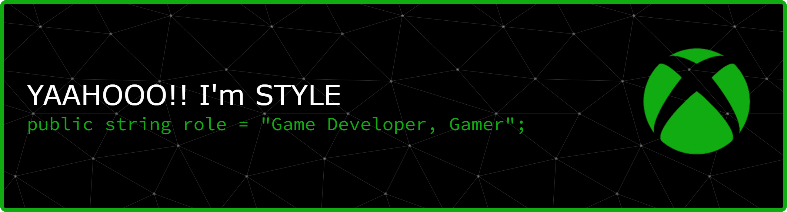

# Yaahooo!! I'm STYLE
<!--
**STYLECS/STYLECS** is a ✨ _special_ ✨ repository because its `README.md` (this file) appears on your GitHub profile.

Here are some ideas to get you started:

- 🔭 I’m currently working on ...
- 🌱 I’m currently learning ...
- 👯 I’m looking to collaborate on ...
- 🤔 I’m looking for help with ...
- 💬 Ask me about ...
- 📫 How to reach me: ...
- 😄 Pronouns: ...
- ⚡ Fun fact: ...
-->
```csharp
public class AboutMe : MonoBehaviour
{
    public string Name             = "Muhammad Nurul Najmi Mertayasa";
    public string MadeUpName       = "STYLE";
    public string Role             = "Game Developer, Gamer";
    public string Location         = "Bali/Gianyar/Sukawati";
    public string[] Passion        = { "Gaming", "Game Programming" };

    void Start()
    {
        Debug.Log("Starting from nothing, becoming something");
    }
}
```
#### ⚙️ Tech Stack :
##### 🎮 Game Development


#### 📱Mobile Apps


#### 🎨 Design


